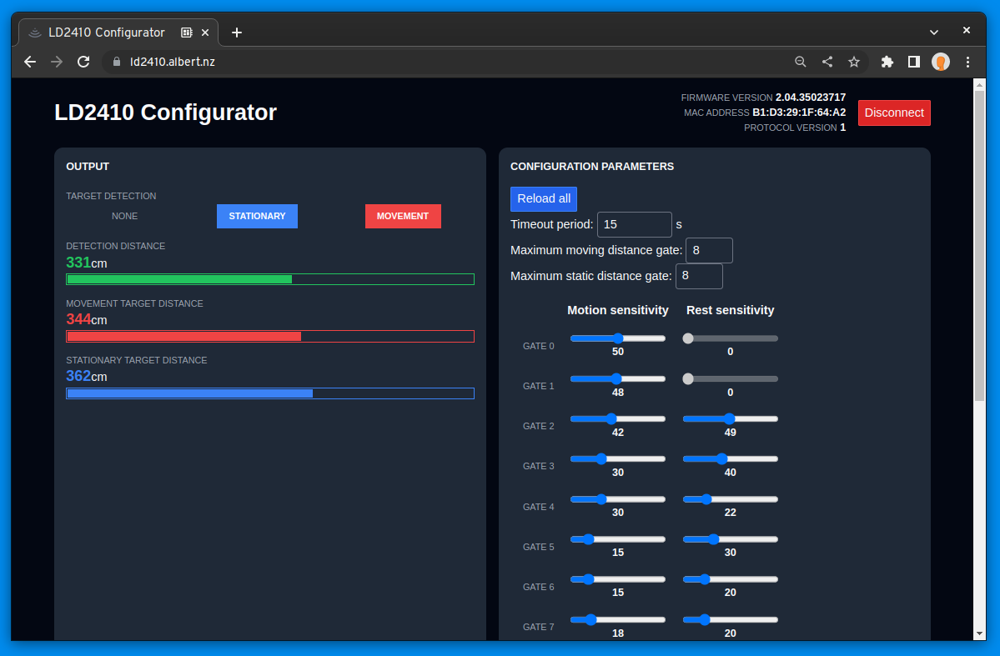

# LD2410 configurator



Display radar data and configure your LD2410 motion sensor, right from the browser! The aim of this project is to improve on the hard-to-use Windows-only tooling provided by HiLink.

Visit the configurator at [ld2410.albert.nz](https://ld2410.albert.nz).

Features:

- Easy to use without any coding
- Cross platform
- Only software dependency is a supported browser
- Compatible with LD2410B and LD2410C

## Usage and compatibility

LD2410 is hosted by Cloudflare Pages at [ld2410.albert.nz](https://ld2410.albert.nz). It can be used from any browser that supports the [WebSerial API](https://developer.mozilla.org/en-US/docs/Web/API/Web_Serial_API) (Chrome, Edge or Opera as at time of writing). Simply go to the site and follow the instructions to get started! You will need a serial adapter such as CP2102.

If you prefer, you can run the tool locally. Simply clone, install and run it using the instructions below.

## Develop

```bash
npm install
```

```bash
npm run dev -- --open
```

## Build

```bash
npm run build
```

## Linting and formatting

ESLint is used for linting. 

```bash
npm run lint      # check
npm run lint:fix  # fix all auto-fixable issues
```

Prettier is used for formatting.

```bash
npm run format       # check
npm run format:fix   # auto-format
```
